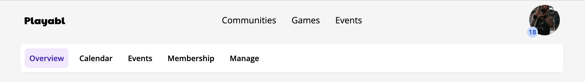
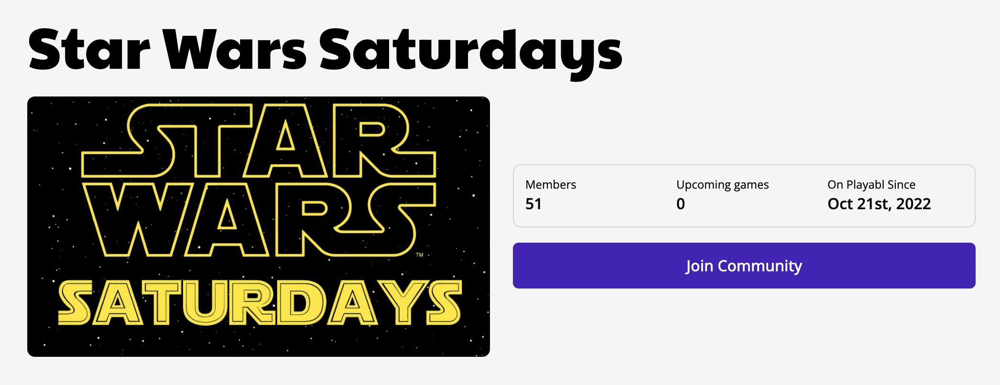

# Finding communities

The [community list](https://app.playabl.io/communities/browse?sort.key=member-count&sort.dir=desc) is used to browse communities and find ones of interest to you. The page filters allow you to customize the results, and the search is saved as a URL, so you can always bookmark it and come back later.

Clicking on a community name will take you to the community page where you can view more information about the community. Use the page navigation controls to explore different areas such as the community calendar. Depending on your community role, you may have additional controls including access to community management.

# Joining a community

In order to play in a community's games, you have to become a member. Different communities have different processes for joining, so check the community information for directions. Playabl offers three ways that communities can manage users joining:

- Public, open access
- Private, by invite only
- Request to join

Public communities allow anyone to join without review. If a community uses this method, you will see a button to join the community on the community's overview page.

Private communities can only be joined by an invite link. If you want to join a private community, ask a community admin for an invite link. The community may have information specified about the conditions of membership that you should review.

Request communities allow anyone to request membership. The request can include a message, and the community admins can then review the request and approve or deny it. If a community uses this method, you will see a request to join button in the same place as the join button for public communities.

