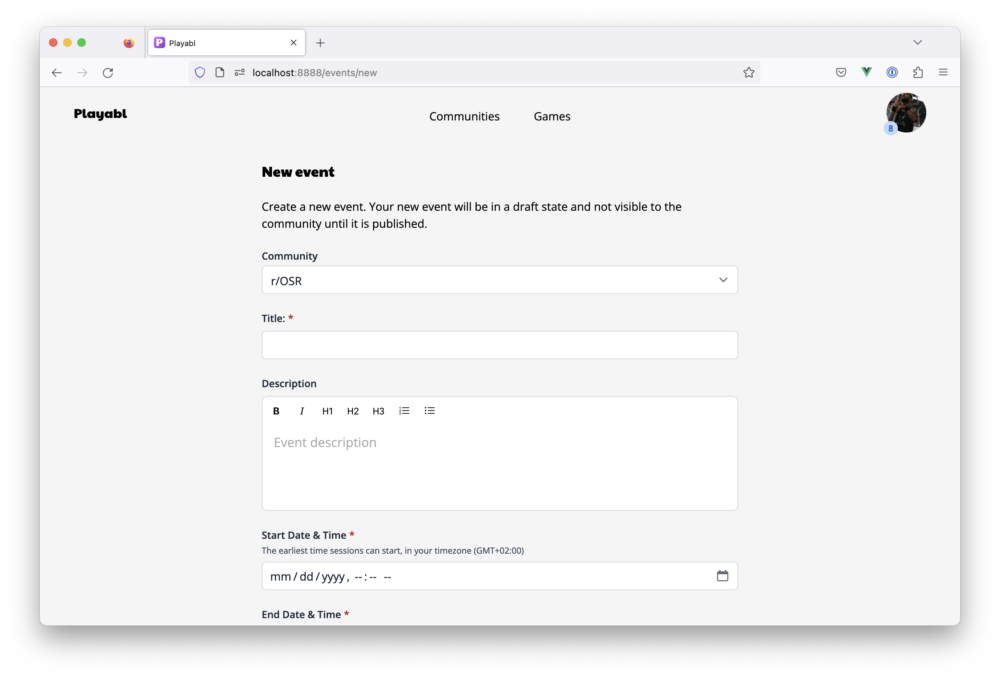

# Running Events

Events offer a way to group games around a theme, occassion, or whatever other purpose you'd like. Events have their own calendar to make discovering and browsing games easy, and configuration options give you control to determine exactly who can join event games and how RSVPs will be handled - either via the normal priority system or at a set time determined by you.

## The General Event Process

In general, events on Playabl work as follows:

- A community administrator decides to create an event and defines some information about it (title, description, start time, etc)
- The event starts in a draft state which lets community creators add games and admins can fine tune details before it’s visible to the general public on Playabl
- Games added to the event inherit event settings including start and end time boundaries, access restrictions, and RSVP times, if set
- Now your event is published live across the site! It can be found from various places including your Community page and the new [Events list](https://app.playabl.io/events/browse) which will list published events across all communities to promote discoverability. Games that are part of the event will show up in the [Browse list](https://app.playabl.io/games/browse) and will have extra treatment to identify they are part of an event on both the listing and main game page

Use this list to guide when setting up your event. You'll want to consider how you communicate with your community creators so that they know the event is available to add games to.

## Creating Events

Every event has the following attributes:

- Title
- Description
- Starting time - this is when the event starts and determines the earliest that a game / session can start
- Ending time - this is when the event ends and determines the latest a game / session can go till
- Access restriction (optional) - you can optionally restrict event access to select members based on access policy assignments. You can also opt to allow default access to everyone in the community.
- RSVP time (optional) - this time, if set, will determine when RSVP access opens for all games and sessions scheduled for the event. If not set, the normal access policy priority times are used.
- Draft state - when created, the Event is in a draft state. In this state, members with Creator or Admin roles can see the event and add games, but the event will not be visible to regular community members yet. To make the event and games visible, you will need to publish the event. You can continue to add games and sessions after publishing, but it is not possible to go back to draft.

## Adding Games to Events

Game creators can add a game to an event by selecting the event from a dropdown choice that will appear in the new game creation form. The dropdown will list any upcoming events that have not been cancelled.

If an event is selected during the new game creation process, the event settings will be applied enforcing things like earliest start time, latest end time, and access controls.

The new game process can also be started from the Event page. Creators will see an “Add game to event” button that will launch the new game form and pre-fill the event dropdown selection.

## Managing Events

On the Event page, Admins of the community will see a Manage section. From here you can manage the event including:

- Updating details like title, description, start time, end time
- Publishing the event to make it visible to all members
- Reviewing some basic statistics like number of games created and total sessions (click either tile to view the data!)
