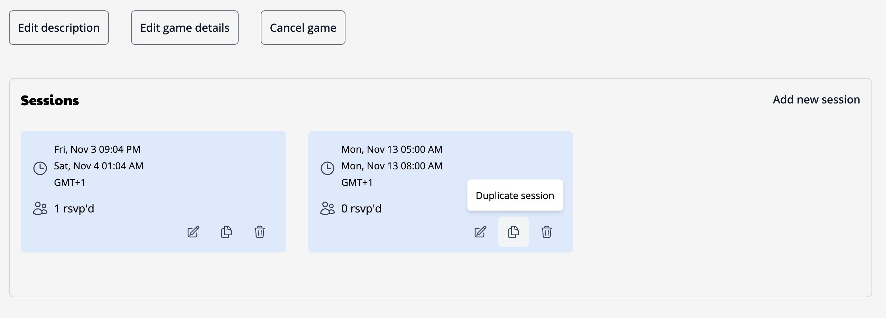

# Creating a new game

To create a new game, go to the [new game page](https://app.playabl.io/games/new). If you have multiple communities, you'll first be asked to choose which one you're creating a game for. After selecting, you'll see a form where you can enter the game details. You can always update these details afterwards as well.

Some tips and notes:

- You can enter any system you like, but sticking to the pre-defined list can help others find it by the designated name. Don't see a system? [Adding or requesting it is easy!](https://github.com/Playabl-io/playabl/discussions/128)
- Game images are shown in 16:9 ratio, so using a wide image will get the best results.

## Managing your games

On each game's page, you'll have the option to navigate to the Manage section. Here, you can perform various activities like adding new sessions, deleting sessions, updating the game details, or cancelling the game.

### Adding and removing sessions

You have two options when you want to add a new session - create a new session or copy an existing one. If you want the new session to have the same set of players from another session, then you should copy the session. After copying, you can then edit the session time to your desired time.

Otherwise, you can add a new session which will not have any RSVPs and will be available for others to join.

To remove a session, click the trash can and you will be asked to confirm the action. Warning, this cannot be undone!

