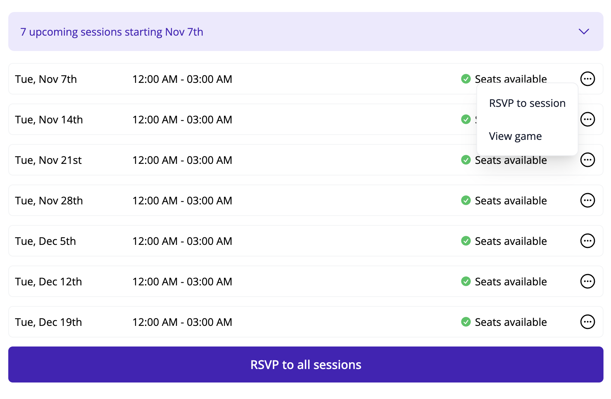
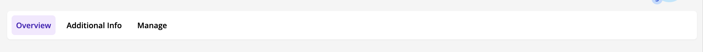
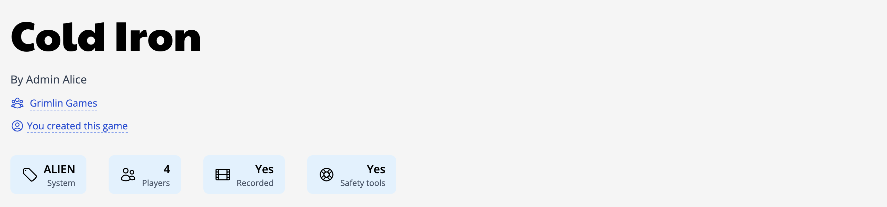
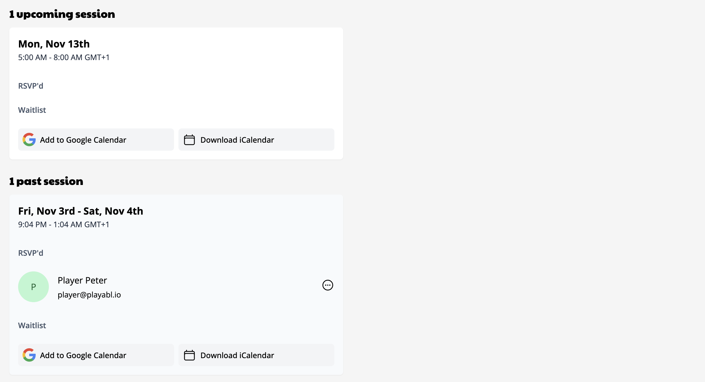

# Finding and joining games

## Using the Games Browse page

The [Games Browse page](https://app.playabl.io/games/browse?sort.key=start_time&sort.dir=asc) allows you to browse and search for games that are of interest to you. It's recommended to use the filters to narrow the results. If you have signed in, you can also save your time preference setting to your profile and it will be automatically applied whenever you are signed in. The browser URL will reflect the search as well, so you can bookmark and share the link with others (user time preference is the exception to this).

When signed in, it is possible to interact and RSVP to games directly from the browsing list. To view and rsvp to the game sessions, click to expand the session summary. You'll see a list of the sessions and the option to RSVP to all, if you're allowed. Clicking on each session's action menu will reveal other options available.

### Available filters

| Filter              | Effect                                                                                                   |
| ------------------- | -------------------------------------------------------------------------------------------------------- |
| Community           | Limit results to the communities selected                                                                |
| System              | Filter by system. Supports partial matches.                                                              |
| Min and Max Players | Set the minimum or maximum players allowed                                                               |
| Time of Day         | Set one or both times. Sessions occuring outside the range are filtered out. Not part of the search URL. |
| Has Openings        | Show only games where one or more sessions have open seats                                               |
| Is Recorded         | Games that are recorded                                                                                  |
| Uses Safety Tools   | This game uses safety tools                                                                              |

:::tip
As you change filters, the URL updates so you can save it and come right back to that search again!
:::

## The Game Detail page

The Game Detail page gives all of the information about the game. We'll review each area in detail.

### Game navigation

At the top, you'll find the navigation for the Game. Depending on your role and RSVP status, you may see additional links as shown here. Overview is the game information and sessions. Additional Info can be used by the game GM to add more information that is only visible to the game players. And Manage allows the game creator and community admins to manage the game and sessions as needed.

### Game information

Next, you'll find the game information. This lists who is facilitating the game, what community the game is being run with, whether you have access to RSVP, and displays of game info including the system, max player count, if it's recorded, and if safety tools are in use.

### Game sessions

In this area you will find all upcoming and past sessions for the game. Each displays the time of the session and the current attendees and waitlist. If you have access, you can join or leave the session. Depending on the priority times the game creator and community make use of, you may not be able to RSVP yet, and yours will open in the future. In this case, the time at which you will be able to RSVP will be shown.

### Game about

Last is the full About section. This is where the game creator will make their pitch for this game and give other relevant information about it.

## Joining Games

When you've found a game you're interested in, it's time to join! You do this by clicking "Join session" and you will see a success message as well as you will show up in the session RSVPs.

To review your upcoming games, the [home dashboard](https://app.playabl.io/) offers a great view of your next seven days. If your session is further out, you can see the full list on the [joined games page](https://app.playabl.io/games/joined)

## Other ways to browse games

A quick note - there are a variety of other ways to browse games on the site not mentioned here. The Community Calendar with it's list and calendar views offers a very different browsing experience. It does some things better, but most things worse. Therefore, there is an effort is currently underway to review and streamline this. The vision is that the Browse page will be the main way to find games, and it should enable the user to find what is most relevant. It will continue to be enhanced and bring in the positive elements from the other areas until it can completely replace them.
